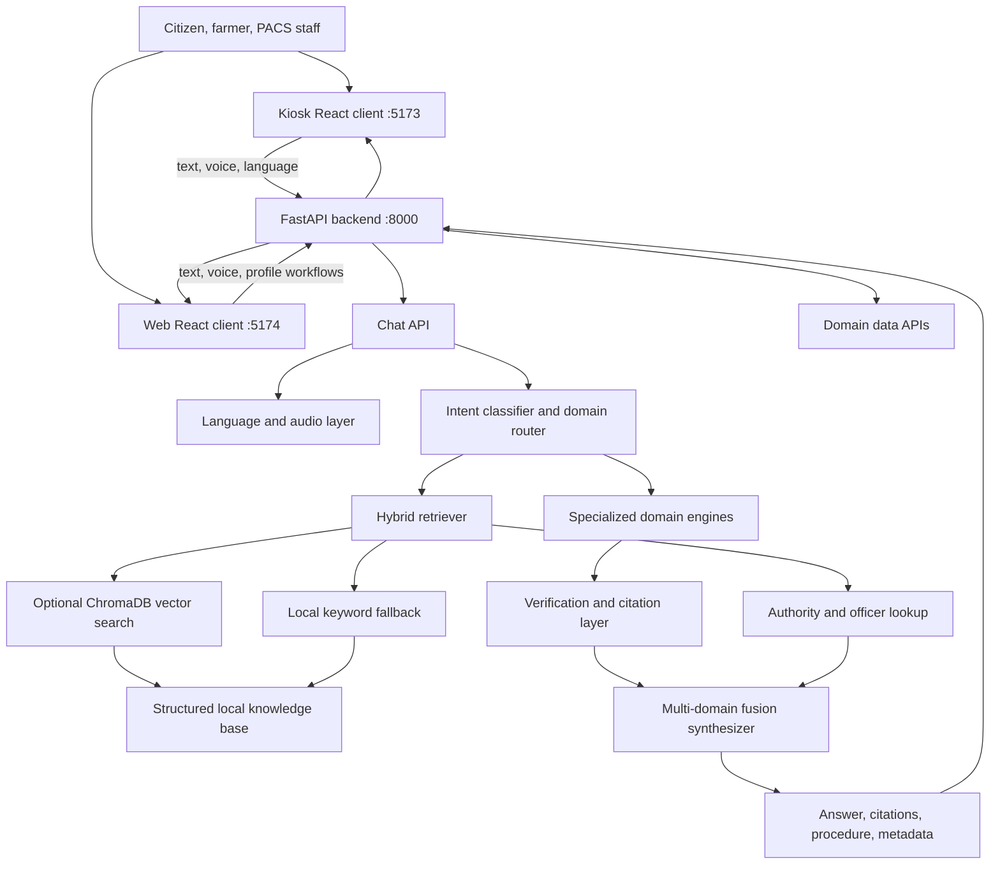

# Multilingual Cooperative Governance and Legal Assistance Portal

**Team BRAVITS | Smart India Hackathon 2026 | Problem Statement SIH26088**

## 1. Executive Summary

The Multilingual Cooperative Governance and Legal Assistance Portal is an AI-assisted information and resolution platform for farmers, rural citizens, PACS secretaries, cooperative society members, and field officers.

The project brings statutory and scheme-related information into a single conversational interface. A user can ask a question by text or voice, in one of 11 supported Indian languages, and receive a domain-specific answer assembled from a local knowledge base. The response can include source citations, verified facts, a confidence/trust score, a recommended officer, and a step-by-step procedure for grievance or claim resolution.

The repository contains two React clients:

- **Kiosk UI (`frontend`, port 5173):** A simplified, touch-friendly interface intended for PACS offices, rural kiosks, Raspberry Pi-class devices, or mini PCs.
- **Citizen Web Portal (`frontend-web`, port 5174):** A fuller portal with profiles, chat history, FAQs, office locator, theme and text-size controls, and PDF conversation export.

The backend is a FastAPI service on port 8000. It coordinates language handling, intent classification, domain-specific engines, retrieval, verification, officer recommendation, and response synthesis.

## 2. Problem Being Addressed

Farmers and cooperative society members often need help with information that is distributed across laws, government schemes, insurance guidelines, PACS procedures, office directories, and grievance channels. Common difficulties include:

- Finding reliable information in a familiar language.
- Understanding cooperative laws and statutory sections.
- Knowing which documents, office, or officer are required.
- Meeting deadlines such as the PMFBY localized-calamity reporting window.
- Navigating several levels of grievance escalation.
- Accessing assistance in areas with unreliable connectivity.
- Distinguishing official guidance from unsupported or hallucinated answers.

The project addresses these difficulties by combining a multilingual conversational experience with a structured, citation-oriented knowledge and resolution workflow.

## 3. Proposed Solution

The solution is a domain-aware cooperative assistance platform with five important principles:

1. **One conversational entry point:** Users can ask questions naturally instead of searching several portals.
2. **Domain specialization:** Questions are routed to the relevant law, scheme, PACS, PMFBY, financial-literacy, or grievance engine.
3. **Grounded answers:** Responses are generated from local structured data, legal material, authorities, and retrieved records.
4. **Actionable resolution:** The system can return procedures, timelines, document guidance, escalation paths, and officer recommendations.
5. **Multilingual and edge-oriented delivery:** The clients support 11 languages and are designed to continue using local data when advanced retrieval or network services are unavailable.

## 4. Functional Features

### 4.1 Multilingual interaction

Supported language codes are `en`, `hi`, `ta`, `te`, `mr`, `kn`, `bn`, `gu`, `ml`, `pa`, and `or`.

The clients provide language selection and translated interface strings. Voice recognition maps these language codes to Indian browser locales such as `en-IN`, `hi-IN`, and `ta-IN`.

### 4.2 Text and voice questions

Users can submit typed questions to the chat API. The kiosk client also supports:

- Browser `SpeechRecognition` / `webkitSpeechRecognition` when available.
- Browser microphone access through `navigator.mediaDevices.getUserMedia()`.
- `MediaRecorder` audio capture.
- Backend voice submission through `/api/v1/chat/voice`.
- Text-to-speech through `/api/v1/chat/tts`.
- Browser `speechSynthesis` fallback when backend audio is unavailable.

### 4.3 Cooperative law and by-law assistance

The law domain covers cooperative legislation and related procedures, including subjects represented in the local data such as MSCS provisions, state by-laws, voting, arbitration, ombudsman processes, and membership disputes.

The law data is exposed through `/api/v1/law/` and is also available to the retrieval pipeline.

### 4.4 Farmer schemes

The scheme domain provides information about farmer and cooperative schemes, including scheme purpose, eligibility, benefits, departments, and responsible designations where present in the data.

The API exposes:

- `/api/v1/schemes/` for the combined scheme and PMFBY catalogue.
- `/api/v1/schemes/pmfby` for PMFBY-specific guidance.

### 4.5 PMFBY crop insurance guidance

The PMFBY domain handles crop insurance questions such as localized calamities, claim reporting, crop-loss procedures, assessment, and escalation. The knowledge base includes the 72-hour localized-calamity intimation rule and the `14447` helpline reference.

### 4.6 PACS services

The PACS domain supports questions about Primary Agricultural Credit Societies, membership, PACS services, modernization, multi-service hubs, loans, fertilizer and seed services, and related by-laws.

PACS data is exposed through `/api/v1/pacs/`.

### 4.7 Financial literacy and KCC guidance

The financial domain covers KCC and cooperative financial topics, including interest subvention, collateral-free limits, scale-of-finance concepts, and loan-related processes.

Financial data is exposed through `/api/v1/financial/`.

### 4.8 Grievance registration and resolution navigation

The grievance workflow can:

- Classify a grievance.
- Generate a resolution procedure.
- Provide escalation guidance and timelines.
- Recommend an authority or officer when matching directory data exists.
- Register a grievance containing applicant, mobile, district, society, category, complaint, and language fields.
- List registered tickets through `/api/v1/grievance/tickets`.
- Return the authority directory through `/api/v1/grievance/authorities`.

Registration is handled by `/api/v1/grievance/register`.

### 4.9 Officer and authority recommendation

Retrieved records can carry a responsible designation. The authority lookup layer combines that designation with the query and district information to resolve a matching officer or authority from the local officer directory.

When a precise match is not available, the system can return an incomplete or no-record result. Directory normalization and district coverage therefore affect recommendation quality.

### 4.10 Verification and explainability metadata

Chat responses include structured metadata such as:

- Primary and active domains.
- Intent confidence.
- Citations.
- Verification status.
- Trust score.
- Verified facts.
- Corrections applied.
- Source authority.
- Extracted query slots.
- Procedure and authority information.
- Multi-domain classification status.

This makes the answer more inspectable than a plain unqualified chatbot response.

### 4.11 Citizen web-portal features

The web portal additionally provides:

- First-use language and user-profile onboarding.
- Chat sessions persisted in browser `localStorage`.
- New chat, session selection, and session deletion.
- FAQ modal.
- Office locator modal.
- Account and profile modal.
- Light/dark theme.
- Normal/large text-size setting.
- Conversation PDF export.
- Topic shortcuts for grievance, PMFBY, PACS registration, and KCC topics.

### 4.12 Kiosk-oriented features

The kiosk client provides:

- Language-first onboarding.
- Large, touch-friendly controls.
- Welcome screen and guided chat flow.
- Domain cards for law, schemes, PACS, PMFBY, finance, and grievances.
- Quick questions.
- Voice input and spoken answer playback.
- Notification and diagnostic-style panels.
- Local theme preference.

The kiosk label describes the deployment form factor. The current repository does not contain drivers or protocols for GPIO, USB, serial, RFID, biometric, printer, camera, or sensor hardware.

## 5. Technical Architecture



### 5.1 Request workflow

1. The user selects a language and submits text or voice.
2. The client sends a request to the FastAPI backend.
3. The chat service passes the request to `RAGPipeline`.
4. The language detector checks the query and can update the active language for Indic-script input.
5. `IntentClassifier` identifies the primary domain and any additional active domains.
6. `HybridRetriever` searches the local knowledge corpus and collects citations and authority information.
7. The matching specialized submodel generates domain guidance. The available submodels are farmer schemes, grievance, PACS/PMFBY, cooperative law, and financial literacy.
8. The fusion synthesizer combines answers from multiple active domains and performs post-processing and verification.
9. The resolution navigator adds a procedure when the query is a grievance, delay, rejection, complaint, or related issue.
10. The API returns the answer and structured evidence metadata.
11. The client renders the response and can play it through backend TTS or browser speech synthesis.

### 5.2 Retrieval workflow

The retrieval layer supports two modes:

- **Semantic mode:** ChromaDB and Sentence-Transformers are used when installed and a usable persisted collection is available.
- **Keyword fallback:** Local JSON documents are tokenized and ranked using a lightweight term-matching score when semantic dependencies or the vector index are unavailable.

The fallback loads data from the schemes, financial, grievances, PACS, PMFBY, and laws directories. This is the practical offline path used when the full ML stack is not installed.

### 5.3 Voice workflow

The kiosk browser first tries native browser speech recognition and records microphone audio with `MediaRecorder`. The resulting transcript or audio is sent to the backend. The backend can use the configured STT backend for uploaded audio, then routes the transcription through the same RAG pipeline as a typed question.

For output, the backend attempts configured TTS generation. The client can play returned audio or fall back to the browser's `speechSynthesis` API.

## 6. Technology Stack

### Backend and AI engine

- Python 3.10+ target, with the supplied Dockerfile based on Python 3.11.
- FastAPI for the HTTP API.
- Uvicorn for serving the application.
- Pydantic and pydantic-settings for schemas and configuration.
- `python-multipart` for voice file/form uploads.
- HTTPX and Requests for HTTP integrations.
- PyYAML for configuration/data handling.
- ChromaDB for optional persisted vector retrieval.
- Sentence-Transformers for optional embeddings.
- gTTS for online TTS fallback.
- pydub and NumPy-backed audio utilities for audio processing.

### Frontend

- React 18.
- Vite 5.
- `lucide-react` for icons.
- `react-markdown` and `remark-gfm` for formatted assistant responses.
- `jsPDF` in the web portal for PDF export.
- Browser Web Speech, MediaRecorder, Audio, and Speech Synthesis APIs where supported.

### Data and storage

- JSON files under `database/data` for domain knowledge.
- JSON authority directory under `database/authorities`.
- JSON officer directory under `database/data/officers`.
- Optional persisted vector database under `database/vector_db`.
- Browser `localStorage` for frontend preferences and web chat sessions.
- In-process grievance service storage for the current backend implementation.

### Deployment and development

- Native development launcher: `start_all.sh` or `start_all.bat`.
- Docker Compose configuration for the backend and kiosk service.
- Backend port `8000`.
- Kiosk port `5173`.
- Web portal port `5174`.

## 7. API Surface

| Endpoint | Purpose |
| --- | --- |
| `GET /health` | Backend health and offline-mode status |
| `POST /api/v1/chat/` | Process a typed multilingual question |
| `POST /api/v1/chat/voice` | Process uploaded audio or a supplied transcript |
| `POST /api/v1/chat/tts` | Generate speech audio for an answer |
| `GET /api/v1/schemes/` | List farmer schemes and PMFBY data |
| `GET /api/v1/schemes/pmfby` | Return PMFBY guidelines |
| `GET /api/v1/pacs/` | Return PACS by-law/service data |
| `GET /api/v1/law/` | Return cooperative law data |
| `GET /api/v1/financial/` | Return financial-literacy data |
| `POST /api/v1/grievance/register` | Register a grievance |
| `GET /api/v1/grievance/tickets` | List registered grievances |
| `GET /api/v1/grievance/authorities` | Return authority directory data |

Interactive documentation is available at `http://localhost:8000/docs` when the backend is running.

## 8. Deployment Workflow

### Local native workflow

1. Create a Python virtual environment.
2. Install the backend requirements.
3. Run `npm install` inside both `frontend` and `frontend-web`.
4. Start FastAPI on port 8000.
5. Start the kiosk Vite app on port 5173.
6. Start the web portal Vite app on port 5174.
7. Open the required client and verify `/health` and a representative chat query.

The full `sentence-transformers` dependency can install a very large PyTorch runtime. For lightweight offline keyword mode, the API can run with the web/API dependencies and NumPy while ChromaDB and Sentence-Transformers remain absent.

### Docker workflow

The supplied `docker-compose.yml` is intended to build the Python backend and a kiosk frontend container. The backend Dockerfile uses Python 3.11 and installs the root requirements. The current repository should be checked before using the compose frontend service because the compose file references a `frontend/Dockerfile`, while the frontend directory may not contain that file in every checkout.

### Edge-oriented workflow

The intended edge deployment is a small computer such as a Raspberry Pi or mini PC connected to a touchscreen, microphone, and speaker. In the current implementation, these peripherals are accessed through the browser and operating system audio stack. The application does not directly control GPIO or specialized kiosk peripherals.

## 9. Current Implementation Boundaries

The project documentation and UI describe an ambitious zero-hallucination, offline edge platform. The code supports the grounding and fallback direction, but the following boundaries are important:

- ChromaDB and Sentence-Transformers are optional at runtime because the retrieval class has a keyword fallback.
- Advanced offline Whisper STT requires additional packages and model files; the current requirements file does not install `faster-whisper` or the model assets.
- Piper TTS is optional and requires voice models. gTTS is an online fallback, so it is not fully offline.
- Browser speech recognition and microphone APIs depend on browser support and permission settings.
- Officer recommendations depend on district and designation matching in the local directory.
- Grievance persistence is service-level/in-process in the current implementation; a production deployment should use a durable database and authentication.
- The kiosk UI is hardware-friendly but is not a hardware driver or device-management layer.
- The current CORS configuration allows all origins and should be restricted for production.
- API authentication, authorization, rate limiting, audit logging, and encrypted production storage are not represented as complete production controls in the current code.

## 10. Recommended Production Enhancements

1. Add a durable database for users, grievances, tickets, and audit history.
2. Add authentication and role-based access for citizens, PACS staff, officers, and administrators.
3. Normalize and expand officer directory designations and district coverage.
4. Package tested CPU-only embedding/runtime dependencies or provide a documented lightweight profile.
5. Bundle and validate offline STT/TTS models for the target edge device.
6. Add integration adapters for printers, scanners, RFID/NFC, GPIO buttons, and device health reporting where required.
7. Add health checks for model availability, vector index freshness, audio devices, disk space, and network state.
8. Restrict CORS and add request validation, rate limiting, logging, and monitoring.
9. Add automated tests for every API endpoint, each domain route, multilingual responses, voice fallbacks, and grievance lifecycle behavior.

## 11. Running the Project

With dependencies installed, the documented services are:

```bash
# Backend
python -m uvicorn backend.app.main:app --host 0.0.0.0 --port 8000 --reload

# Kiosk UI
cd frontend
npm run dev -- --host 0.0.0.0 --port 5173

# Citizen Web Portal
cd frontend-web
npm run dev -- --host 0.0.0.0 --port 5174
```

Open:

- `http://localhost:5173` for the kiosk interface.
- `http://localhost:5174` for the citizen web portal.
- `http://localhost:8000/docs` for the API explorer.

## 12. Conclusion

This project combines a multilingual conversational interface with cooperative-law data, farmer schemes, PMFBY guidance, PACS services, financial literacy, grievance navigation, source metadata, and authority recommendations. Its central contribution is not only answering questions, but connecting a user's question to a domain, a grounded knowledge record, an actionable procedure, and, where possible, the responsible office or officer.

The current repository is best understood as a working software platform with an edge-friendly kiosk client. It already supports browser-level audio interaction and local knowledge fallback, while direct hardware integration, production persistence, full offline speech models, and operational security remain further implementation stages.